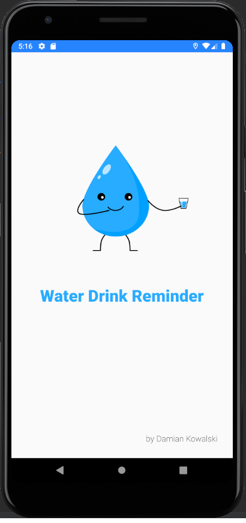
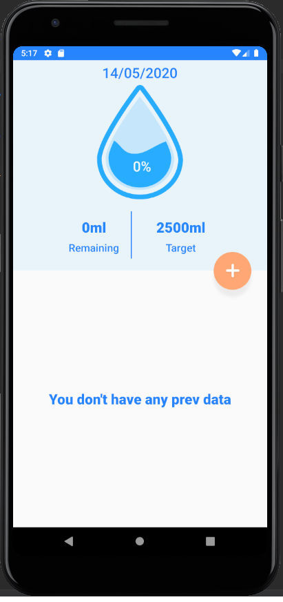
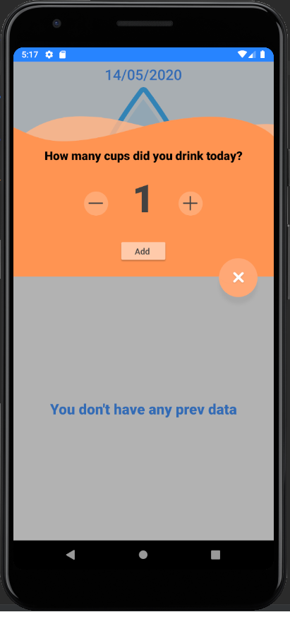
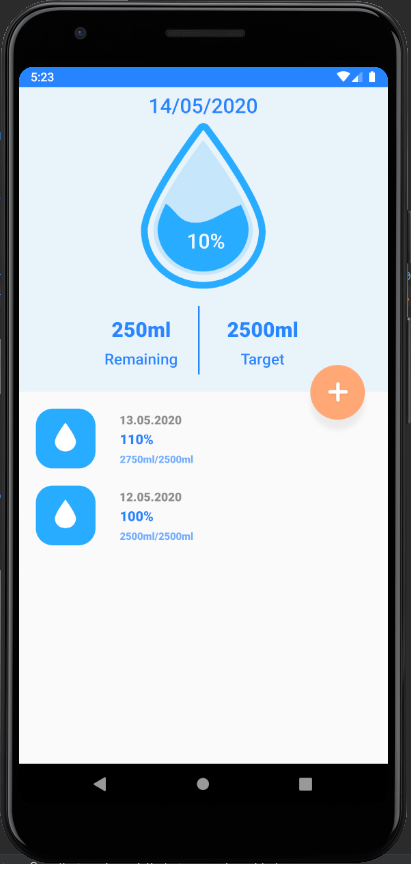

# Water Drink Reminder - android app

A simple application used to improve the habit of drinking the right amount of water

Used in application:
* Kotlin languague
* MVP pattern
* Room Persistance Library - to store historical data

# Screens

